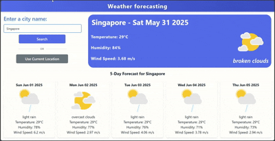

# 🌤️ Weather-Dynamic-Forecast

A modern and responsive weather forecasting web application built with **React.js** and **Chakra UI**. This app provides users with real-time weather data, today's forecast, and a dynamic 5-day forecast including GIFs representing weather conditions.

🔗 **Live Website:** [https://pragin-t.github.io/Weather-Dynamic-Forecast/](https://pragin-t.github.io/Weather-Dynamic-Forecast/)

## 🚀 Features

- 🔍 City-based weather search  
- 📍 Geolocation-based weather detection  
- 🌦️ Current weather display  
- 📅 5-day weather forecast with date, temp, humidity, wind speed  
- 🎞️ Dynamic weather-based GIFs  
- 📱 Fully responsive design using Chakra UI  

---

## 📸 Screenshots

### Weather App Demo


### Mobile App Demo


## 🛠️ Tech Stack

- **React.js**  
- **Chakra UI**  
- **OpenWeatherMap API**  
- **JavaScript (ES6+)**  
- **HTML5 & CSS3**  

---

## 📁 Project Folder Structure

- `Weather-Dynamic-Forecast/`  
  - `public/`  
    - `index.html`  
    - `favicon.ico`  
    - `weather-demo.gif`  
    - `Clouds.gif`  
    - `Sunny.gif`  
    - `Rain.gif`  
    - `...other weather GIFs`  
  - `src/`  
    - `Component/`  
      - `Nav.js`  
      - `Search_Form.js`  
      - `Today_Forecast.js`  
      - `Forecast_Display.js`  
      - `Home_page.js`  
    - `Api.js`  
    - `index.js`  
  - `.env`  
  - `.gitignore`  
  - `package.json`  
  - `README.md`  
  - `LICENSE`  

---

## 🧪 Local Setup

1. **Clone the repository**:

   ```bash
    git clone https://github.com/Pragin-T/Weather-Dynamic-Forecast.git
    cd Weather-Dynamic-Forecast
2. **Install Modules**:
    ```bash
    npm install @chakra-ui/react @emotion/react @emotion/styled framer-motion
    npm install
    npm start
   

🔐 **API Usage**  
This app uses the OpenWeatherMap API.

📄 **License**  
This project is licensed under the [MIT License](./LICENSE).

🙋‍♂️ Author
Made with ❤️ by T. Pragin
GitHub
